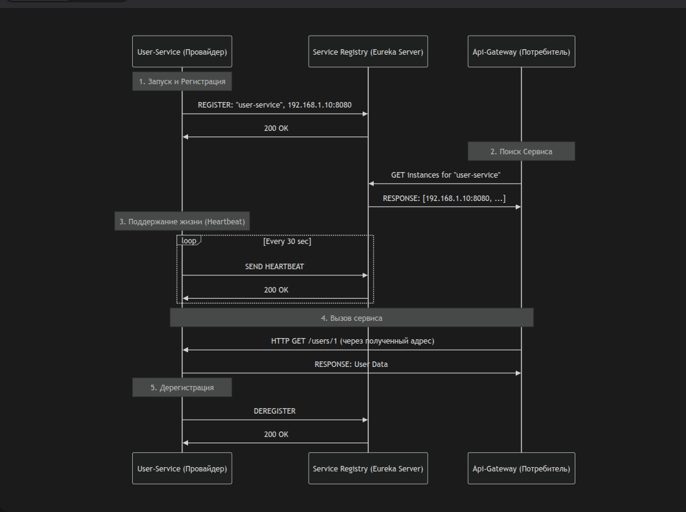

Коллеги, приветствую.

В рамках проектирования и разработки современных распределенных систем на Java, понимание **Service Discovery (Обнаружение Сервисов)** является критически важным. Это один из краеугольных камней микросервисной архитектуры.

Давайте разберем принцип его работы на русском языке, с точки зрения Senior Java-разработчика.

---

### Что такое Service Discovery?

**Service Discovery** — это механизм, который позволяет сетевым службам находить друг друга и общаться в динамической среде, где адреса (IP и порты) экземпляров сервисов не являются фиксированными.

**Проблема, которую он решает:** В "монолите" компоненты общаются через локальные вызовы методов. В микросервисной архитектуре, особенно когда она работает в оркестраторе вроде Kubernetes, экземпляры сервисов могут:
*   **Динамически создаваться** и **уничтожаться** (автоскейлинг, обновления, отказы).
*   **Менять свои IP-адреса и порты** при каждом перезапуске.

Прописывать адреса сервисов в конфигурационных файлах становится невозможным. Нужен "посредник", который будет знать, "кто где находится".

### Ключевые компоненты

В любой реализации Service Discovery есть две основные роли:

1.  **Сервер Обнаружения (Service Registry)**
    *   Это база данных (часто in-memory) всех активных экземпляров сервисов.
    *   Каждый экземпляр при запуске **регистрируется** в этом реестре, сообщая свои метаданные (например, `service-name`, `host:port`, `health-check endpoint`).
    *   При остановке экземпляр должен **дерегистрироваться**.
    *   *Примеры: Eureka Server, Consul, Zookeeper, Nacos.*

2.  **Клиент Обнаружения (Service Client)**
    *   Это часть приложения (обычно библиотека внутри вашего Java-сервиса), которая умеет взаимодействовать с Server Registry.
    *   Её задачи:
        *   При старте сервиса — зарегистрировать его в реестре (`REGISTER`).
        *   Периодически отправлять "сигнал жизни" (heartbeat) для подтверждения своей работоспособности (`SEND HEARTBEAT`).
        *   При получении запроса на вызов другого сервиса — обратиться к реестру, чтобы получить актуальный список доступных экземпляров нужного сервиса (`LOOKUP` / `DISCOVER`).
        *   При graceful shutdown — удалить себя из реестра (`DEREGISTER`).

### Принцип работы (на примере клиент-серверного подхода, как в Netflix Eureka)

Рассмотрим классический поток на примере двух сервисов: `User-Service` (провайдер) и `Api-Gateway` (потребитель).



**Шаг 1: Регистрация Сервиса-Провайдера**
*   `User-Service` запускается.
*   Встроенный в него **Eureka Client** автоматически отправляет запрос на Eureka Server: "Зарегистрируй меня, я `user-service`, мой адрес `192.168.1.10:8080`".
*   Eureka Server сохраняет эту запись в своем реестре.

**Шаг 2: Поиск Сервиса-Потребителем**
*   `Api-Gateway` хочет сделать запрос к `user-service`, чтобы получить данные о пользователе.
*   Его **Eureka Client** обращается к Eureka Server и спрашивает: "Дай мне все доступные адреса для `user-service`".
*   Eureka Server возвращает список (например, `[192.168.1.10:8080, 192.168.1.11:8080]`).

**Шаг 3: Поддержание жизнеспособности (Health Check)**
*   `User-Service` каждые 30 секунд (по умолчанию) отправляет Eureka Server heartbeat-запрос.
*   Это подтверждает, что сервис "жив". Если Eureka Server не получает heartbeat в течение определенного времени (например, 90 секунд), он помечает экземпляр как недоступный и удаляет его из списка для запросов на обнаружение.

**Шаг 4: Непосредственный вызов сервиса**
*   `Api-Gateway` получает от Eureka Client актуальный адрес `user-service`.
*   Теперь он может напрямую выполнить HTTP/RPC-вызов по этому адресу.

**Шаг 5: Дерегистрация при остановке**
*   При корректном завершении работы `User-Service` отправляет запрос на удаление себя из реестра. Это обеспечивает быструю маршрутизацию трафика на другие, живые экземпляры.

### Client-Side vs Server-Side Discovery

*   **Client-Side Discovery (описан выше):** Клиент сам получает список всех экземпляров и сам выбирает, к какому из них обратиться (часто с помощью простого Round Robin). *Пример: Netflix Ribbon + Eureka.*
*   **Server-Side Discovery:** Клиент делает запрос на "постоянный" адрес (например, Load Balancer'а или DNS-имя), а сам Load Balancer уже обращается к реестру сервисов и перенаправляет трафик на здоровый экземпляр. *Пример: Kubernetes Services.*

### Реализации в Java-экосистеме

1.  **Spring Cloud Netflix Eureka:** Самый популярный выбор в мире Spring. Простой в настройке, интегрируется "из коробки" с другими Spring Cloud компонентами.
2.  **Spring Cloud Consul:** Использует Consul от HashiCorp, который является более комплексным решением (включая K/V хранилище, проверку здоровья и т.д.).
3.  **Zookeeper / Apache Curator:** Более низкоуровневое решение, требует больше ручной работы, но очень надежное.
4.  **Kubernetes Native:** В Kubernetes Service Discovery встроен на уровне платформы. Ваш сервис автоматически регистрируется через kube-proxy и становится доступен по DNS-имени вида `my-service.my-namespace.svc.cluster.local`.

### Практический пример с Spring Boot + Eureka

1.  **Eureka Server:**
    ```java
    @SpringBootApplication
    @EnableEurekaServer
    public class ServiceDiscoveryApplication {
        public static void main(String[] args) {
            SpringApplication.run(ServiceDiscoveryApplication.class, args);
        }
    }
    ```
    `application.yml`:
    ```yaml
    server:
      port: 8761
    eureka:
      client:
        register-with-eureka: false # Сам сервер не регистрируется в себе
        fetch-registry: false
    ```

2.  **Eureka Client (User-Service):**
    ```java
    @SpringBootApplication
    @EnableEurekaClient
    public class UserServiceApplication {
        public static void main(String[] args) {
            SpringApplication.run(UserServiceApplication.class, args);
        }
    }
    ```
    `application.yml`:
    ```yaml
    spring:
      application:
        name: user-service # Уникальное имя сервиса!
    server:
      port: 0 # Случайный порт (часто используется в облачных средах)
    eureka:
      client:
        service-url:
          defaultZone: http://localhost:8761/eureka/
      instance:
        prefer-ip-address: true
    ```

### Заключение

**Service Discovery** — это не просто "модная фича", а необходимость для создания отказоустойчивых, масштабируемых и динамичных систем. Как Senior Java-разработчик, вы должны не только уметь подключать Eureka к своему Spring Boot приложению, но и глубоко понимать принципы работы этого механизма, его сильные стороны (децентрализация, отказоустойчивость) и слабые (дополнительная точка отказа в лице Registry, необходимость надежных health checks).

Это знание позволяет принимать взвешенные архитектурные решения и правильно устранять неполадки в продакшн-среде.